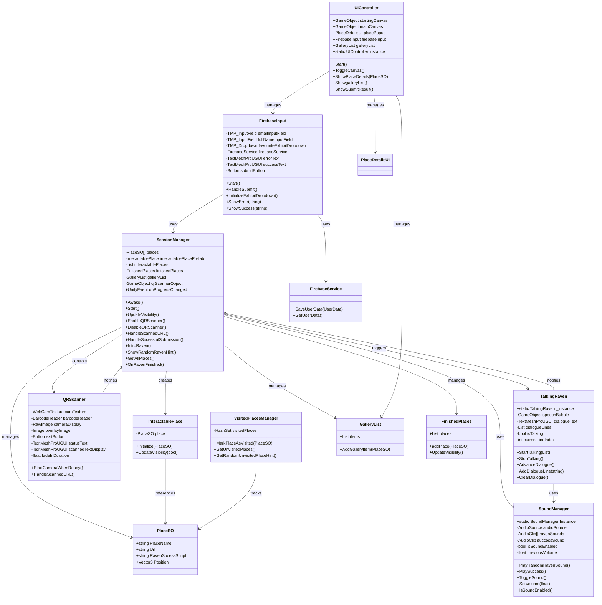
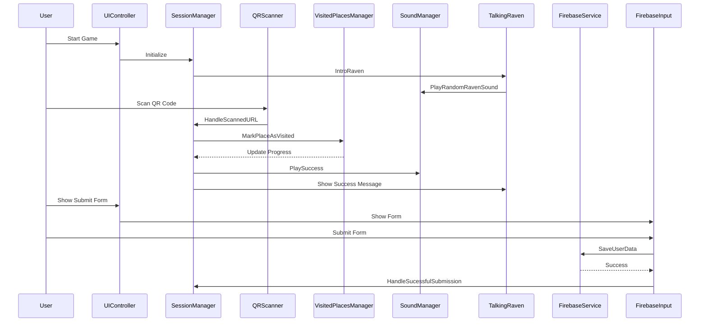

# System Architecture Documentation

## Class Diagram

## System Flow

## Key Features and Responsibilities

### SessionManager

- Central manager for the application
- Handles place management and progression
- Coordinates between different systems
- Manages QR scanner and raven interactions
- Controls game flow and state

### UIController

- Manages all UI state and transitions
- Controls canvas visibility
- Handles place details display
- Manages gallery list visibility
- Coordinates form submission

### SoundManager

- Handles all audio playback
- Manages sound state (on/off)
- Controls volume settings
- Provides sound effects for various events
- Maintains volume state when toggling

### FirebaseService

- Handles data persistence
- Manages user data storage
- Provides data retrieval functionality
- Handles async operations

### QRScanner

- Manages camera access
- Handles QR code scanning
- Provides visual feedback
- Implements smooth fade-in transitions
- Manages UI elements for scanning

### VisitedPlacesManager

- Tracks visited places
- Manages place completion state
- Provides hints for unvisited places
- Maintains visit history

### TalkingRaven

- Manages dialogue system
- Coordinates with SoundManager for audio
- Provides user guidance and feedback
- Handles dialogue progression
- Manages speech bubble visibility
